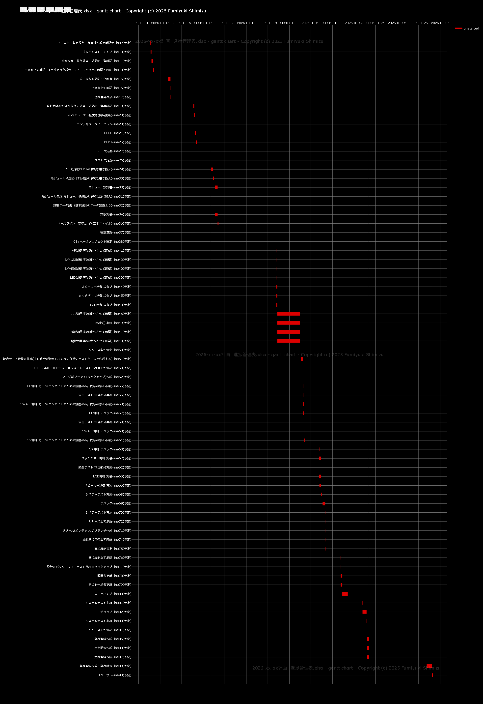

##### 概要

---

某『プロジェクト型演習』での進捗管理を補助します。スプレッドシートに記載されたタスクについて、

* 各受講者ごとのCS記載内容を提示
* タスクの重複や現状での問題を表示
* スプレッドシートでの簡易ガントチャートおよびズーム可能なガントチャートの生成

などをします。権利は[LICENSE](LICENSE)記載の通りです。ご自由にご利用ください。関連して発生した損害などは一切責任を負うことはできません。著作権表記を削ったり変更しないでください。

##### 実行例 (Google Colaboratory - Jupyter Notebookを使う場合)

---

必要なファイルは 進捗管理表.xlsx と shishiodoshi.ipynb だけでclone不要です。

Googleドライブのマイドライブにssodという名前のフォルダを作成し、そこに 進捗管理表.xlsx をアップロードします。

shishiodoshi.ipbynbファイルもマイドライブの任意の場所にアップロードします。

Googleドライブ上でアップロードしたshishiodoshi.ipbynbをダブルクリックしてColabを起動します。

「すべてのセルを実行」をクリックします。途中の権限の設定などは提示に従って進めてください。Googleドライブのアクセスについてはファイルの読み込みだけが必要な権限です。

進捗管理表.xlsx の場所については最初のセルで変更できます。マイドライブ上にあるものしか開けないので、他者所有のチームで共有しているファイルはそのファイルのショートカットをマイドライブの ssod フォルダに作成し、ショートカットの名前を 進捗管理表.xlsx にすれば開けます。

##### 実行例 (オンプレの場合)

---

```
winget install Python.Python.3.13    (Windozeの例)
git clone https://github.com/fmrns/shishiodoshi.git
cd shishiodoshi
pip install -r requirements.txt      (venvなど各自の環境に合わせてください)
python prj.py ...somewhere/進捗管理表.xlsx
```

##### 設定例 進捗管理表.xslx

---

プログラム内で以下のマーカーを検出しています。変更する場合はプログラムの変更が必要です。

* 1行目セルを値で検出して直下のセルを取得(アイボリーのセル)
* 5行目以降のセルを値で検出してタスクの各値の列を取得(アイボリーのセル)
* O列より右で、同じ日付が縦に並んでいるセルをカレンダーの左上とする

###### 休日設定

休日をまたいだタスクの稼働時間の算出のために休日を設定します。デフォルトは月曜日から金曜日が開講、土曜日、日曜日が休講、祝日は関知しない、です。

* 土日に開講する場合はカレンダーの曜日セルに「開」と記入します。
* 月から金に休講する場合は曜日セルに「休」または「祝」と記入します。

###### 担当者(リソース)設定

G列からN列が担当者列です。1チーム最大8名で作成してありますが、必要に応じてN列からO列の手前を増やしてください。K列からN列は非表示にしてあるので、利用する場合は該当部分の列記号をクリックして非表示を解除してください。役割がリーダーとなっている担当者のCS出力にはチームの進捗が付加されます。リーダー不在の場合は別途出力されます。役割がない担当者はプログラマとして出力されます。

###### タスク設定

プロジェクト管理に慣れていない方は依存関係の設定での無駄な時間のロスや、並行作業を設定してトータルでの出力が減るなどの傾向がある(ししおどし作成理由)ので、タスクは任意に作成することができ、ししおどしが不備や問題を検出するように設計しました。最低限必要な依存関係はセルの参照や加算(1日単位なので、+ 1で1日、+ 1/24で1時間、+ 1/1440で1分加算できます)で設定します。

進捗管理表.xlsx の中のサンプルタスクはサンプル更新を簡単にするためにカレンダー開始日からの相対値となっていますが、普通に絶対値で記入可能です。

リソースにが並行タスクが割り当たっている場合は警告を出します。工数の均等割りなどはしません(前述のとおり)。

タスクの不備検出追加のご提案はissue作成してください。PRも歓迎です。

##### 実行例

---

```
xlsx:/content/drive/My Drive/ssod/進捗管理表.xlsx, nw:2026-01-31T13:00, Google Colab
2026-01-13 Tuesday  : 開講
2026-01-14 Wednesday: 開講
2026-01-15 Thursday : 開講
2026-01-16 Friday   : 開講
2026-01-17 Saturday : 休講
2026-01-18 Sunday   : 休講
2026-01-19 Monday   : 開講
2026-01-20 Tuesday  : 開講
2026-01-21 Wednesday: 開講
2026-01-22 Thursday : 開講
2026-01-23 Friday   : 開講
2026-01-24 Saturday : 休講
2026-01-25 Sunday   : 休講
2026-01-26 Monday   : 開講
2026-01-27 Tuesday  : 開講
2026-01-28 Wednesday: 開講
2026-01-29 Thursday : 開講
2026-01-30 Friday   : 開講
2026-01-31 Saturday : 休講
--------------------------------------------------
基準: 2026-xx-xx計画
チーム名: foo
--------------------------------------------------
あいうさん
役割: リーダー
--------------------------------------------------
えおかさん
役割: テックリード
--------------------------------------------------
きくけさん
役割: タイムキーパー
--------------------------------------------------
こさしさん
役割: ファシリテーター
--------------------------------------------------
最終調整-line91: 予定完了日時がありません。

================================================================================
あいうさん CS(1)
--------------------------------------------------
チーム名  : foo
担当タスク: チーム名・暫定役割・議事録作成更新開始-line9, ブレインストーミング-line10, 企画立案・前例調査・納品物一覧確認-line11, 企画案上司確認: 指示があった場合: フィージビリティ確認・PoC-line13, すてきな製品名・企画書-line15, 企画書上司承認-line16, 企画書発表会-line17, 自販機演習および前例の調査・納品物一覧再確認-line19, イベントリスト仮置き(随時更新)-line20, コンテキストダイアグラム-line23, DFD0-line24, DFD1-line25, データ定義-line27, STS分割(DFD1の単純な書き換え)-line29, モジュール構造図(STS分割の単純な書き換え)-line30, モジュール設計書-line33, ベースライン「基準1」作成(本ファイル)-line36, 役割更新-line37, CS+ベースプロジェクト選定-line38, VR制御 実装(動作させて確認)-line41, スピーカー制御 スタブ-line44, abc管理 実装(動作させて確認)-line46, リリース条件策定-line50, 統合テスト仕様書作成(主に自分が担当していない部分のテストケースを作成する)-line51, リリース条件・統合テスト兼システムテスト仕様書上司承認-line53, 統合テスト 該当部分実施-line56, 統合テスト 該当部分実施-line59, VR制御 マージ(コンパイルのための調整のみ。内容の修正不可)-line61, VR制御 デバッグ-line63, スピーカー制御 実装-line66, システムテスト実施-line68, デバッグ-line69, システムテスト実施-line70, リリース上司承認-line72, 機能追加可否上司確認-line74, 追加機能策定-line75, 追加機能上司承認-line76, 設計書バックアップ、テスト仕様書バックアップ-line77, 設計書更新-line78, コーディング-line80, システムテスト実施-line81, デバッグ-line82, システムテスト実施-line83, リリース上司承認-line84, 発表資料作成-line86, 発表資料作成・発表練習-line89, リハーサル-line90
役割      : リーダー
--------------------------------------------------
あいうさん CS(2)
--------------------------------------------------
ベースライン: 2026-xx-xx計画
行程      : 100.00% (10日/10日 2026-01-31 13:00+09:00/2026-01-13 13:00+09:00/2026-01-26 16:05+09:00)
--------------------------------------------------
予定進捗率(チーム): 100.00% (311.16hr/311.16hr)
実績進捗率(チーム): 0.00% (0.00hr/311.16hr)
実績/予定 (チーム): 0.00% (0.00%/100.00%)
--------------------------------------------------
予定進捗率: 100.00% (78.00hr/78.00hr)
実績進捗率: 0.00% (0.00hr/78.00hr)
実績/予定 : 0.00% (0.00%/100.00%)
コメント  :
☆ タスクが開始されていません:
   チーム名・暫定役割・議事録作成更新開始-line9                                      予定開始日時: 2026-01-13 13:00+09:00 <= 2026-01-31 13:00+09:00
   ブレインストーミング-line10                                                       予定開始日時: 2026-01-13 13:20+09:00 <= 2026-01-31 13:00+09:00
   企画立案・前例調査・納品物一覧確認-line11                                         予定開始日時: 2026-01-13 14:19+09:00 <= 2026-01-31 13:00+09:00
   企画案上司確認: 指示があった場合: フィージビリティ確認・PoC-line13                予定開始日時: 2026-01-13 16:00+09:00 <= 2026-01-31 13:00+09:00
   すてきな製品名・企画書-line15                                                     予定開始日時: 2026-01-14 09:00+09:00 <= 2026-01-31 13:00+09:00
   企画書上司承認-line16                                                             予定開始日時: 2026-01-14 11:30+09:00 <= 2026-01-31 13:00+09:00
   企画書発表会-line17                                                               予定開始日時: 2026-01-14 11:35+09:00 <= 2026-01-31 13:00+09:00
   自販機演習および前例の調査・納品物一覧再確認-line19                               予定開始日時: 2026-01-15 13:00+09:00 <= 2026-01-31 13:00+09:00
   イベントリスト仮置き(随時更新)-line20                                             予定開始日時: 2026-01-15 13:59+09:00 <= 2026-01-31 13:00+09:00
   コンテキストダイアグラム-line23                                                   予定開始日時: 2026-01-15 14:30+09:00 <= 2026-01-31 13:00+09:00
   DFD0-line24                                                                       予定開始日時: 2026-01-15 15:00+09:00 <= 2026-01-31 13:00+09:00
   DFD1-line25                                                                       予定開始日時: 2026-01-15 16:00+09:00 <= 2026-01-31 13:00+09:00
   データ定義-line27                                                                 予定開始日時: 2026-01-15 16:45+09:00 <= 2026-01-31 13:00+09:00
   STS分割(DFD1の単純な書き換え)-line29                                              予定開始日時: 2026-01-16 09:00+09:00 <= 2026-01-31 13:00+09:00
   モジュール構造図(STS分割の単純な書き換え)-line30                                  予定開始日時: 2026-01-16 10:59+09:00 <= 2026-01-31 13:00+09:00
   モジュール設計書-line33                                                           予定開始日時: 2026-01-16 13:00+09:00 <= 2026-01-31 13:00+09:00
   ベースライン「基準1」作成(本ファイル)-line36                                      予定開始日時: 2026-01-16 16:00+09:00 <= 2026-01-31 13:00+09:00
   役割更新-line37                                                                   予定開始日時: 2026-01-19 09:00+09:00 <= 2026-01-31 13:00+09:00
   CS+ベースプロジェクト選定-line38                                                  予定開始日時: 2026-01-19 09:04+09:00 <= 2026-01-31 13:00+09:00
   VR制御 実装(動作させて確認)-line41                                                予定開始日時: 2026-01-19 09:09+09:00 <= 2026-01-31 13:00+09:00
   スピーカー制御 スタブ-line44                                                      予定開始日時: 2026-01-19 09:29+09:00 <= 2026-01-31 13:00+09:00
   abc管理 実装(動作させて確認)-line46                                               予定開始日時: 2026-01-19 10:30+09:00 <= 2026-01-31 13:00+09:00
   リリース条件策定-line50                                                           予定開始日時: 2026-01-20 13:00+09:00 <= 2026-01-31 13:00+09:00
   統合テスト仕様書作成(主に自分が担当していない部分のテストケースを作成する)-line51 予定開始日時: 2026-01-20 13:05+09:00 <= 2026-01-31 13:00+09:00
   リリース条件・統合テスト兼システムテスト仕様書上司承認-line53                     予定開始日時: 2026-01-20 15:00+09:00 <= 2026-01-31 13:00+09:00
   統合テスト 該当部分実施-line56                                                    予定開始日時: 2026-01-20 15:29+09:00 <= 2026-01-31 13:00+09:00
   統合テスト 該当部分実施-line59                                                    予定開始日時: 2026-01-20 16:00+09:00 <= 2026-01-31 13:00+09:00
   VR制御 マージ(コンパイルのための調整のみ。内容の修正不可)-line61                  予定開始日時: 2026-01-20 16:30+09:00 <= 2026-01-31 13:00+09:00
   VR制御 デバッグ-line63                                                            予定開始日時: 2026-01-21 09:00+09:00 <= 2026-01-31 13:00+09:00
   スピーカー制御 実装-line66                                                        予定開始日時: 2026-01-21 09:29+09:00 <= 2026-01-31 13:00+09:00
   システムテスト実施-line68                                                         予定開始日時: 2026-01-21 10:59+09:00 <= 2026-01-31 13:00+09:00
   デバッグ-line69                                                                   予定開始日時: 2026-01-21 13:00+09:00 <= 2026-01-31 13:00+09:00
   システムテスト実施-line70                                                         予定開始日時: 2026-01-21 16:00+09:00 <= 2026-01-31 13:00+09:00
   リリース上司承認-line72                                                           予定開始日時: 2026-01-21 16:09+09:00 <= 2026-01-31 13:00+09:00
   機能追加可否上司確認-line74                                                       予定開始日時: 2026-01-21 16:14+09:00 <= 2026-01-31 13:00+09:00
   追加機能策定-line75                                                               予定開始日時: 2026-01-21 16:20+09:00 <= 2026-01-31 13:00+09:00
   追加機能上司承認-line76                                                           予定開始日時: 2026-01-22 09:00+09:00 <= 2026-01-31 13:00+09:00
   設計書バックアップ、テスト仕様書バックアップ-line77                               予定開始日時: 2026-01-22 09:04+09:00 <= 2026-01-31 13:00+09:00
   設計書更新-line78                                                                 予定開始日時: 2026-01-22 09:09+09:00 <= 2026-01-31 13:00+09:00
   コーディング-line80                                                               予定開始日時: 2026-01-22 10:59+09:00 <= 2026-01-31 13:00+09:00
   システムテスト実施-line81                                                         予定開始日時: 2026-01-23 09:00+09:00 <= 2026-01-31 13:00+09:00
   デバッグ-line82                                                                   予定開始日時: 2026-01-23 09:29+09:00 <= 2026-01-31 13:00+09:00
   システムテスト実施-line83                                                         予定開始日時: 2026-01-23 13:59+09:00 <= 2026-01-31 13:00+09:00
   リリース上司承認-line84                                                           予定開始日時: 2026-01-23 14:30+09:00 <= 2026-01-31 13:00+09:00
   発表資料作成-line86                                                               予定開始日時: 2026-01-23 14:35+09:00 <= 2026-01-31 13:00+09:00
   発表資料作成・発表練習-line89                                                     予定開始日時: 2026-01-26 09:00+09:00 <= 2026-01-31 13:00+09:00
   リハーサル-line90                                                                 予定開始日時: 2026-01-26 15:00+09:00 <= 2026-01-31 13:00+09:00
がんばります。
```


